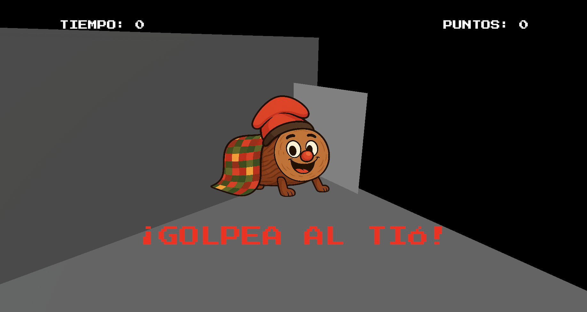

# Tio AR

  

**Tio AR** is a mobile Augmented Reality (AR) mini-game developed with **Unity 6** using **XR / AR Foundation**.  
Players must locate the **Tió** in their real environment and hit it as many times as possible before the round timer ends.

This repository is presented as an academic project developed by the **UOC Gamers** team.

---

## Documentation

Extended documentation is available in both languages:

- 🇬🇧 [**English documentation**](README_en.md)
- 🇪🇸 [**Documentación en español**](README_es.md)

---

## Setup & Requirements

Technical requirements, build configuration, and APK installation steps are documented separately:

- 🇬🇧 [**Setup & Requirements (English)**](SETUP.md)
- 🇪🇸 [**Instalación y requisitos (Español)**](INSTALACION.md)

---

## Download APK

The latest APK can be downloaded from the **Releases** section:
- [Releases](./releases)

---

## Related Repository

This project was originally planned as a unified experience including **2D games**, an **AR mode**, and a **3D scene**.  
However, due to integration constraints and build stability issues, the final delivery is split into two repositories.  

- This repository contains the **AR game: Tio AR**

The companion repository contains the **2D games** and the **3D prototype**:

- [**Companion Repository (2D + 3D)**](https://github.com/RaulEstevezA/UOC_Gamers)

---

## Technologies

- Unity 6
- XR Interaction Toolkit
- AR Foundation (ARCore)
- Android build (APK)
- C#
- TextMeshPro

---

## Team

This project was developed by the **UOC Gamers** team:

- **Aleix Ortiz** [GitHub](https://github.com/Aortiz1UOC) | [LinkedIn](https://www.linkedin.com/in/aleix-ortiz-4796291aa/)
- **Carlos Ruz** [GitHub](https://github.com/cruzd92) | [LinkedIn](https://www.linkedin.com/in/carlosruzd92/)
- **Jordi Montserrat** [GitHub](https://github.com/supermusta) | [LinkedIn](https://www.linkedin.com/in/jordi-montserrat-cornejo-4320b886/)
- **Raul Estevez** [GitHub](https://github.com/RaulEstevezA) | [LinkedIn](https://www.linkedin.com/in/raulesteveza/)
- **Roger Mohino** [GitHub](https://github.com/rogermohino) | [LinkedIn](https://www.linkedin.com/in/roger-mohino/)

---

## License

This project is licensed under the **Creative Commons Attribution-NonCommercial-NoDerivatives 4.0 International License**.  
See the [LICENSE](LICENSE) file for details.

---

## Notes

- This README provides a high-level overview of the project.
- Detailed explanations, screenshots, setup steps, and gameplay flow are available in the extended documentation.
- AR features require a compatible device with **ARCore** support.